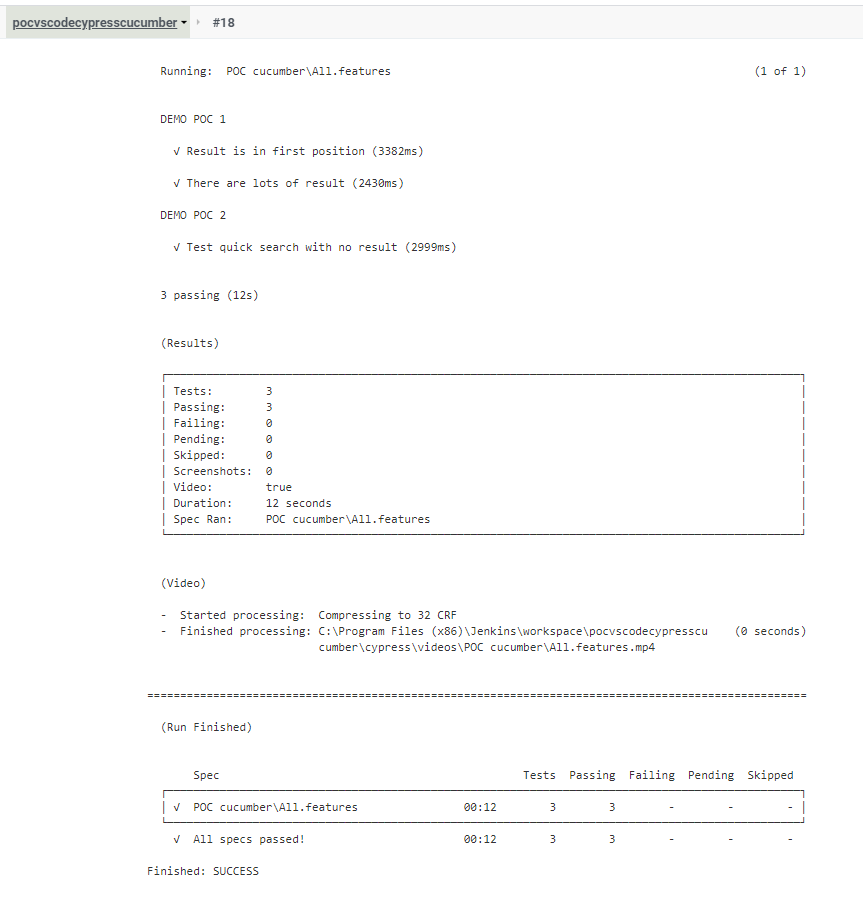
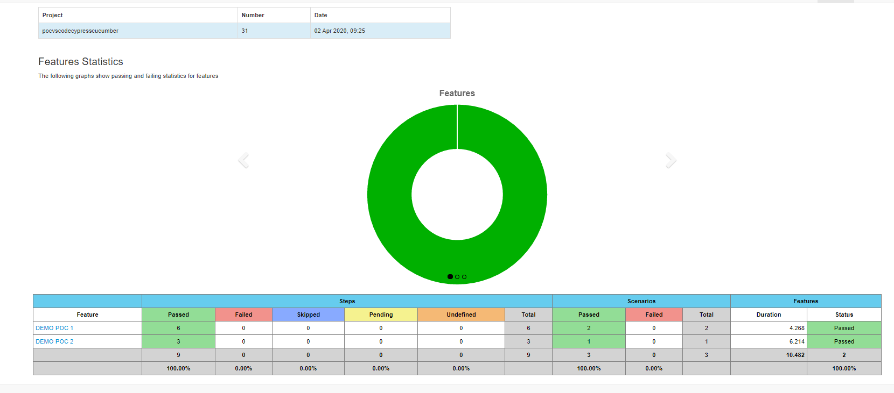

# README #

This README would normally document whatever steps are necessary to get your application up and running.

This README describes how install a projet on vsCode with cypress/cucumber.


## What is this repository for? ##

- This is a POC for vsCode - cypress - cucumber - github
- Version 1.0

## How do I get set up? ##

Prerequisites are:

- A desktop with windows

- Get a vsCode application installed : https://code.visualstudio.com/download (Windows - User Installer	- 64 bit)

- Get NodeJs installed : https://nodejs.org/en/download/ (Windows Installer (.msi) - 64 bit)

- Get git for windows : https://gitforwindows.org/ (click on download)


The installation documentation is divided into two parts, depending on whether you install the project from scratch or if you start from the project available on github.

### Installation from Github project ###
_________________________________________________________________

#### Github ####
1 - Get POC_VS project in local :
On your desktop, do a right click and select "git bash here", type : 

```
		git clone https://github.com/carolinelavergne/POC_VS.git
```
=> The project POC_VS is on your desktop, you can move the folder if you want


#### VS code ####
Open vsCode, open the folder : [File > Open folder...] and select the folder POC_VS
=> The project in vscode is connected to github.

**Note : **
You can pull, push, add files, commit and push ;) 


#### Cypress ####
*(If Cypress executable not found at : C:\Users\USERNAME\AppData\Local\Cypress\Cache\CYPRESS_VERSION\Cypress\Cypress.Exe)*

In vsCode :
1 - Install Cypress : in the terminal window [Terminal > New Terminal], type : 

```
		npm install cypress --save-dev
```


#### Cucumber ####
In vsCode :
1 - Install Cucumber : do [Ctrl+shitf+P] and search for "Extensions: Install extensions" then for "Cucumber (Gherkin) Full Support" [VSCode Cucumber (Gherkin) Language Support + Format + Steps/PageObjects Autocomplete]


### Installation from scratch ###
_________________________________________________________________

#### Github ####
*(only if you want a versioning project)*

1 - In github, create an account : https://github.com/ *(only if you don't have one)*

2 - In github, create a new repository (POC_VS) *(only if this is a new repository)*

3 - On your desktop, do a right click and select "git bash here" and type

```
		git clone github_url
```
=> The project POC_VS is on your desktop, you can move the folder if you want

#### VS code ####

Open vsCode, open the folder : [File > Open folder...] and select the folder POC_VS *(if you skip the Github part, you have to create a folder named POC_VS)*
=> The project in vscode is empty 
=> The project is connected to github *(if you did not skip the Github part)*

**Note : **
You can pull, push, add files, commit and push ;) 


#### Cypress ####
In vsCode :
1 - Install Cypress : in the terminal window [Terminal > New Terminal], type : 

```
		npm install cypress --save-dev
```
=> A package-lock.json file and node_modules folder are created

2 - In the terminal window, type : 

```
		npm init
```
Information are necessary to initialize package.json but can be edited later. Don't panic and type what you want. 

=> A package.json and cypress.json files and cypress folder are created

3 - Update the package.json file with this content :
```
		{
		  "name": "poc_cypress",
		  "version": "1.0.0",
		  "description": "poc cypress",
		  "main": "index.js",
		  "devDependencies": {
			"cypress": "^4.2.0"
		  },
		  "scripts": {
			"start": "./node_modules/.bin/cypress open"
		  },
		  "author": "yourName"
		}
```

4 - Inside the folder POC_VS [POC_VS] :
- Create a folder .vscode
- Create settings.json file inside this folder
- Update the settings.json file with this content :
```
	{
		"cucumberautocomplete.steps": [
			"cypress/integration/**/*.js"
		],
		"cucumberautocomplete.syncfeatures": "cypress/integration/*feature",
		"cucumberautocomplete.strictGherkinCompletion": true
	}
```

**Note : **

You can already execute tests :
In the terminal window, type : 

```
		npm start
```
=> All js files contained in the integration folder will be retrieved. 

5 - Click on the file in which you want to run the tests, the test is running.


#### Cucumber ####
In vsCode :
1 - Install cucumber : [Ctrl+shitf+P] and search for "Extensions: Install extensions" then for "Cucumber (Gherkin) Full Support"

2 - Install cypress-cucumber-preprocessor : in the terminal window [Terminal > New Terminal], type : 

```
		npm install --save-dev cypress-cucumber-preprocessor@2.1.0
```

3 - Update the cypress.json file with this content :
```
	{
	  "integrationFolder": "cypress/integration",
	  "pluginsFile": "cypress/plugins/index.js",
	  "testFiles": "**/*.feature"
	}
```

4 - Update the package.json file with this content : 
```
	{
	  "name": "poc_cypress",
	  "version": "1.0.0",
	  "description": "poc cypress",
	  "main": "index.js",
	  "devDependencies": {
		"cypress": "^4.2.0",
		"cypress-cucumber-preprocessor": "^2.0.1"
	  },
	  "cypress-cucumber-preprocessor": {
		"nonGlobalStepDefinitions": true
	  },
	  "scripts": {
		"start": "./node_modules/.bin/cypress open"
	  },
	  "author": "yourName"
	}
```

5 - Inside the folder integration [POC_VS > cypress > integration] :
- Create a folder POC1 
- Create a file POC1.js inside this folder ==> this file contains the js code to execute the test
- Create a file POC1.feature ==> this file contains the gherkins
(the names of the .feature file, the folder and the main .js file inside the folder are important to execute with succes the test)
[to get example: https://github.com/carolinelavergne/POC_VS/tree/master/cypress/integration/POC cucumber/ : POC1/POC1.js and POC1.feature]

6 - Update the file index.js [POC_VS > cypress > plugins] with this content : 
```
	const cucumber = require('cypress-cucumber-preprocessor').default;
 
	module.exports = (on, config) => {
		on('file:preprocessor', cucumber());
	};
```


### Execute Tests ###
_________________________________________________________________

In vsCode :
1 - In the terminal window [Terminal > New Terminal], type : 

```
		npm start
```

=> A new window is opened with "POC1.feature" file.

2 - In this window, click on POC1.feature, the test is running.


### Jenkins ###
_________________________________________________________________
Prerequisites are:

Get jenkins installed : https://jenkins.io/download/thank-you-downloading-windows-installer-stable/

In jenkins : 
1 - Go to http://localhost:8080/pluginManager/installed, check :

- NodeJS Plugin

- Cucumber reports

- Github

- Pipeline

Click on download and restart jenkins

2 - Go to http://localhost:8080/, create a new item :

- Name it "pocvscodecypresscucumber"

- Select create a pipeline project

- In Pipeline : select "pipeline script from SCM" (in your project, a file named Jenkinsfile should be present, if not create it)

The content of this file is jenkins step :
```
		pipeline {
			agent any
			stages {
				stage("Npm package installation") {
					steps {
						bat label: 'install NPM package', script: 'npm install'
					}
				}
				stage("Cypress installation") {
					steps {
						bat label: 'install cypress', script: 'npm install cypress --save-dev'
					}
				}
						
				stage("Test running") {
					steps {
						bat label: 'Run test', script: 'npm run start_ci'
					}
			
					post {
						always {
							cucumber buildStatus: 'SUCCESS',
								failedFeaturesNumber: -1, 
								failedScenariosNumber: -1, 
								failedStepsNumber: -1, 
								fileIncludePattern: '**/*.json', 
								jsonReportDirectory: 'cypress/cucumber-json/',
								pendingStepsNumber: -1, 
								skippedStepsNumber: -1, 
								sortingMethod: 'ALPHABETICAL'
							archiveArtifacts artifacts: 'cypress/videos/**/*.mp4'
						}
				
						failure {
							archiveArtifacts artifacts: 'cypress/screenshots/**/**/*.png'
						}
					}
				}
			}
		}
```

- In SCM, select Git. Type the repository url : https://github.com/carolinelavergne/POC_VS.git (keep */master as branch and Jenkinsfile as script path)

- Save

3 - Go to http://localhost:8080/view/all/job/pocvscodecypresscucumber/ and launch a build : Build Now

4 - Open the build and click on "console output"
=> You can see the build execution with tests :



5 - Open the build and click on "Cucumber Report"
=> You can see a visual report :




## Who do I talk to? ##

* Repo owner or admin: caroline.lavergne@consort-group.com
