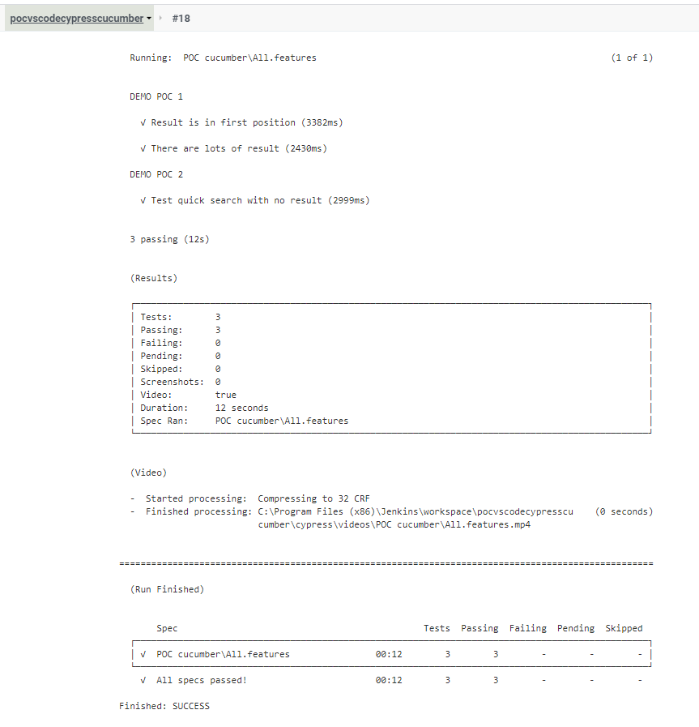

# README #

This README would normally document whatever steps are necessary to write and run tests.

## How do I get set up? ##

Prerequisites are:

-  Get Vs Code, cypress and cucumber : cf SETUP.md

### Files and folders Organization ###

#### .feature ####
The feature files should be in cypress/integration/ : cypress/integration/POC cucumber/POC1.feature
You can create as many files as you want.

#### .js ####
As you can see below, the organization of folders/files are important, like the names of folders and files


For a folder named **POC1.feature** (in the folder POC cucumber), you need a folder **POC1** and inside this folder, the js entry point is a file name **POC1.js** (or any other .js file in the same path)


The js files contain the step definitions for the POC1.feature.

There is a way to create reusable step definitions by putting them in cypress/integration/POC cucumber/common/ : cypress/integration/POC cucumber/common/common.js
Then, inside the main js, add the import : 

```
		import common from '../common/common.js';
```

### How to write a test ###

#### .feature ####
In the feature file, the test is written in Gherkin langage: https://cucumber.io/docs/gherkin/reference/

Example : POC1.feature
```	  
	Feature: DEMO POC 1

   	This feature is created for a demo

   	Background:
      	Given the google WebSite
      
	@wip 
	Scenario: Result is in first position
		When I search for "climaginaire"
		Then the search retrieves "http://www.climaginaire.com/" as results
	
	Scenario Outline: Result is in first position
		When I search for "<keyword>"
		Then the search retrieves "<result>" as results

	Examples:
		| keyword         | result                               |
		| climaginaire    | http://www.climaginaire.com/         |
		| tintin skyblog  | https://objectif-tintin.skyrock.com/ |
		| tricotin        | https://www.tricotin.com/            |
		| tricotin        | https://www.tricotin.com/faux        |

	
	Scenario: The page 2 exists
		When I search for "climaginaire"
		Then the page "2" exists
	
	Scenario: There are lots of result
		When I search for "climaginaire"
		Then the following page exists
			| page |
			|   2  |
			|   3  |
			|   4  |
			|   5  |
			|   6  |
			|   7  |
			|   8  |
```
Only used keywords in this poc are explaned. There are lots of keyword : more information here : https://cucumber.io/docs/gherkin/reference/

**_Feature_**: The first primary keyword in a Gherkin document must always be Feature, followed by a : and a short text that describes the feature. You can add free-form text underneath Feature to add more description.

**_Background_**: Occasionally you’ll find yourself repeating the same Given steps in all of the scenarios in a Feature.

**_Scenario (or Example)_**: This is a concrete example that illustrates a business rule. It consists of a list of steps.
Examples follow this same pattern:
- Describe an initial context (Given steps)
- Describe an event (When steps)
- Describe an expected outcome (Then steps)

**_Scenario Outline & Examples_**: Execute the scenario once for each row in the Example.

**_@ (tags)_**: The tag is used to execute only tagged scenarios in a feature (more explanation below)

**_| (data tables)_**: Data Tables are handy for passing a list of values to a step definition.

#### .features ####
By creating a file All.features, you can execute all tests in all .feature in one time. (more explanation below)
The file is empty, it's alright. 

#### one file .js ####
The js file contains the translation of Gherkins in javascript.
First of all, in all .js files you need to make sure you either require/import the functions defining step definitions :

```
	import { Given, When, Then } from 'cypress-cucumber-preprocessor/steps';
```

Then each Gherkins sentence has an associated js code :

```
	Given('the google WebSite', () => {
		cy.visit("http://www.google.com/");
	});

	When('I search for {string}', (keyword) => {
		// find search bar, type the keyword and cliek enter
		cy.get('.gLFyf').type(keyword + '{enter}');
	});

	Then('the search retrieves {string} as results', (keyword) => {
		cy.get(':nth-child(1) > .rc > .r > a').then(($response) => {
			cy.get($response).invoke('attr', 'href').then($href => {
			expect($href).to.equal(keyword);
			});
		})
	});

	Then('the page {string} exists', (number) => {
		var count = parseFloat(number)+1;
		cy.get(':nth-child(' + count + ') > .fl').should('be.visible');
	});

	Then('the following page exists', (dataTable) => {
		let allPageNumbers = dataTable.hashes();
		allPageNumbers.forEach(($firstPageNumber) => { 
			let number = $firstPageNumber.page;
			var count = parseFloat(number)+1;
			cy.get(':nth-child('+ count +') > .fl').should('be.visible');
		}); 
	});
```

### How to run a test ###

```run``` : a video is recorded in /cypress/videos
```open``` : no video recorded

#### Run all tests in one .feature ####

To run a Cypress Launcher,
1 - In the terminal window, type : 

```
		./node_modules/.bin/cypress open
```

2 - In this window, click on POC1.feature, the test is running.

#### Run all features ####
1 - Create a file All.features in cypress/integration/POC cucumber/ : cypress/integration/POC cucumber/All.features.
The file is empty, it's alright.

2 - Modify the cypress.json, the content is : 

```
	{
		"integrationFolder": "cypress/integration",
		"pluginsFile": "cypress/plugins/index.js",
		"testFiles": "**/*.{feature,features}"
	}
```

**First way to run tests** :
3 - In the terminal window, type : 

```
		npm start
```
4 - In this window, click on All.features, all tests includes in POC1.feature and POC2.feature are running.

**Second way to run tests** :
5 - In package.json, add in the object "script" :

```
        "start_all": "./node_modules/.bin/cypress run --spec 'cypress/integration/**/*.feature'"
```

6 - In the terminal window, type : 

```
		npm run start_all
```
==>  all tests includes in POC1.feature and POC2.feature are running.

#### Run one test in a feature ####
Usage: when you don't when to run all tests, put the tag @wip on the top of the scenario or the feature you want to run.

1 - In package.json, add in the object "script" :
```
        "start_wip": "./node_modules/.bin/cypress run -e TAGS=@wip --spec 'cypress/integration/**/*.feature'"
```

2 - In the terminal window, type : 

```
		npm run start_wip
```
==>  all tests with @wip tag in POC1.feature and POC2.feature are running.

### Reporting ###
To save the last execution, 
1 - In package.json, add in the object "cypress-cucumber-preprocessor" :
```   
    "cucumberJson": {
      "generate": true,
      "outputFolder": "cypress/cucumber-json",
      "filePrefix": "",
      "fileSuffix": ".cucumber"
    }
```
=> After each execution, files POC1.cucumber.json and POC2.cucumber.json will be created with results

#### Jenkins (Bonus) ####
Jenkins is useful for obtaining the history of test runs.

Prerequisites are:

- Get a pipeline configured => SETUP.md

1 - Go to http://localhost:8080/view/all/job/pocvscodecypresscucumber/ and launch a build

2 - Open the build and click on "console output"
=> You can see the build execution with tests :



3 - Open the build and click on "Cucumber Report"
=> You can see a visual report :


## More information ##
https://www.npmjs.com/package/cypress-cucumber-preprocessor#bundled-features-files

## Who do I talk to? ##

* Repo owner or admin: caroline.lavergne@consort-group.com
